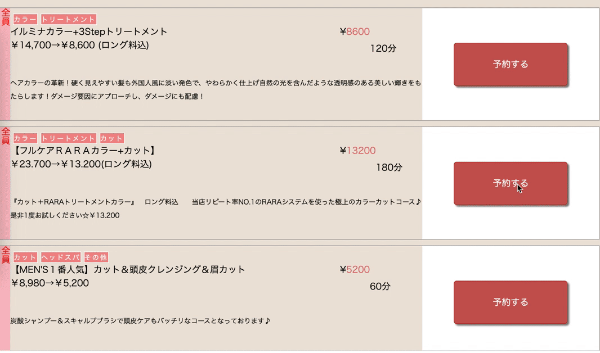
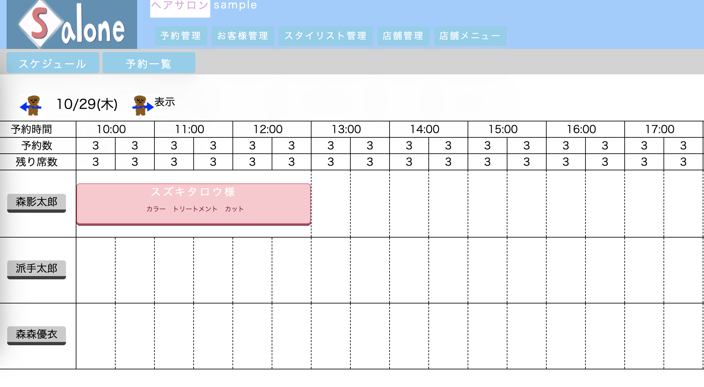
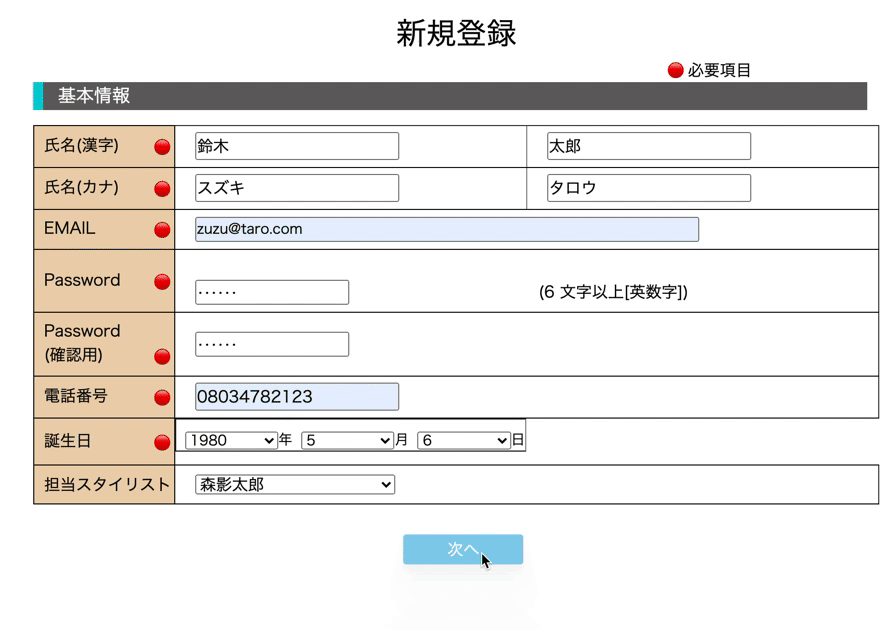
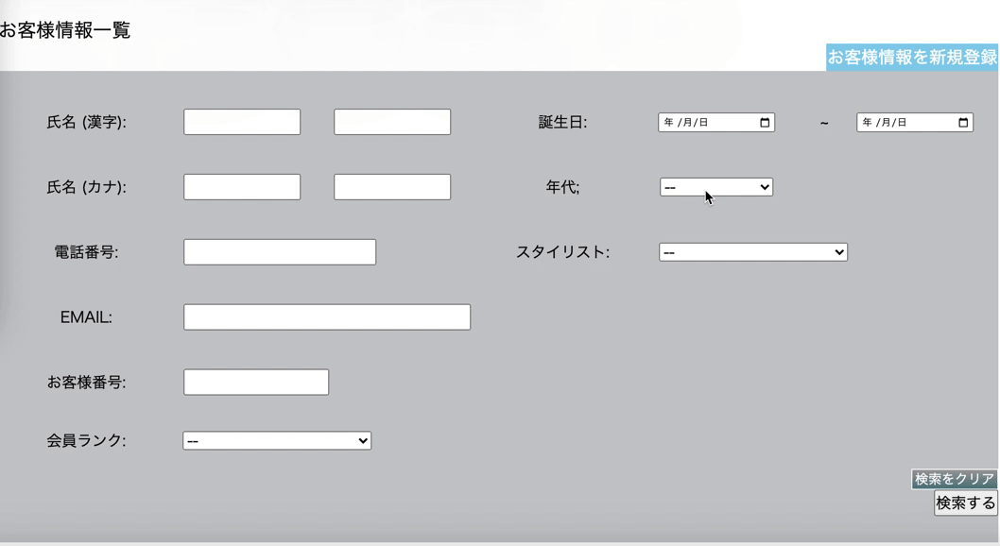
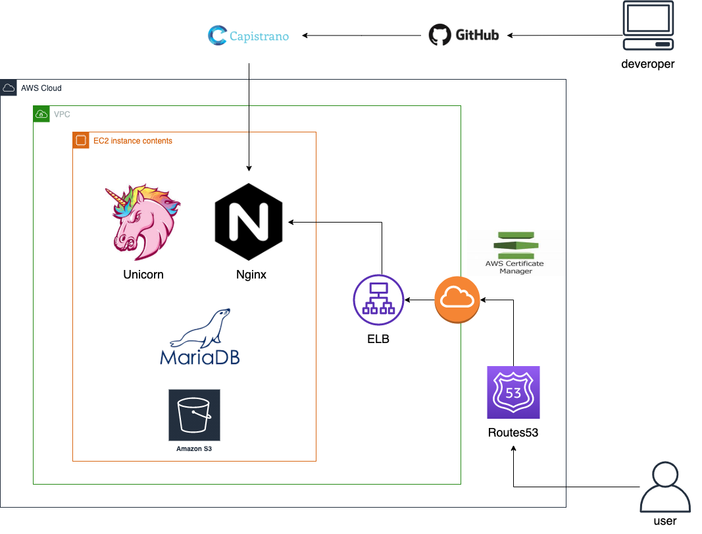
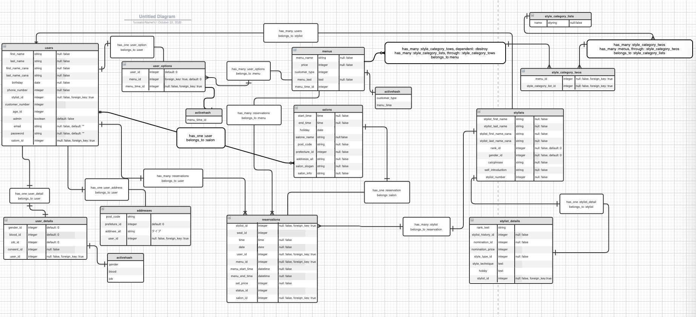

# README

# salone2020

## 概要

**美容室**は顧客の予約管理、個人情報管理ができ、顧客は行きたい美容室に空いている日程を確認しながら予約できるアプリケーション。

## 本番環境

<http://54.150.217.160/>

ログイン情報（テスト用）

- Eメール: test@gmail.com
- パスワード :test123

<http://54.150.217.160/admins/sign_in>

管理者用ログイン画面

ログイン情報

- Eメール: salone@salone.com
- パスワード: salone2020

# 制作背景（意図）

## 
why

前職の経験から美容室の個人店のニーズ捉えたサイトが無かったので作成しました。 
今の美容室向けの予約サイトは集客や広告メインが強く大型店舗や新規顧客に力を入れていた美容室はとても魅力的に感じると思います。 
一方で、圧倒的に数の多い個人店は新規集客に膨大なコストを割くよりも既存集客の予約管理のみが出来ればいいと考えています。
※補足※
現状美容室は約25万件ほどあると言われております。その中でも1店舗あたりのスタイリストの人数は1.5人です。個人店舗の方が圧倒的に多く大型店舗方が少ない事がわかります。

## 
what

私は今回個人店舗向けに予約サイトを作成しました。  
個人店舗では多く集客しての売上向上より、客単価、一人一人のお客様の売上向上を目指しています。
全員同じ単価、メニュー表示ではなく、お客様の事による料金設定、メニュー変更を出来るようにする。お客様によっては満足していれば高い料金で支払っていきます。価格が上がることに敏感なお客様もいる中、美容室がお客様によって表示を細かく分ければメニューの打ち出しもやりやすくなると考えました。  
また、美容師に接して一番感じたことは商品の販売に対する弱さを感じました。  
商品販売に対しては、お客様はいい商品があれば興味ある人が多いにも関わらず売り込むをすることに抵抗が強い美容師が多く商品販売での売上を減らしてしまっている方が多く感じます。ネットで販売案内が厳しい美容業界ですが、美容室とお客様を紐付けた予約サイトを作ることにより、ネットでの案内が実現できると考えております。商品の予約機能を作り、お客様にもっと色々な商品を知ってもう事ができる。そして、予約制にする事ができれば美容室への在庫軽減になると考えています。
色々な美容室にお客様に選んでもうらための予約サイトではなく、個人店舗の美容室のため、１店舗に対するお客様にための予約サイトを作成しています。

# 機能一覧

## 管理者機能
◎ルーティングを管理者のお客様で分ける機能

◎顧客である管理者(admin)

  - ユーザー管理
  - メニュー登録
  - スタイリスト登録
  - 営業時間設定
  - 予約の管理

◎お客様であるユーザー(user)

  - ユーザー登録
  - 予約登録

## 予約機能

◎お客様がメニュー選択し空いている時間選択することで予約できる機能

   - お客様のランク事に表示メニューの変更
   - メニュークリック後予定表のページに遷移
   - 空いている日程から日時時間を選択
   - 確認画面後予約完了

◎予約された日程を顧客が確認

   - 顧客の管理画面にて予約が入った予定を表示

 

## ユーザー登録機能

◎ログイン・サインアップ機能(devise)

   - ウィザード形式にて個人情報の登録
   - メールアドレス・パスワード登録

## メニュー登録機能

◎管理者である顧客がメニューを登録

   - メニュー名入力欄
   - 価格入力欄
   - 複数のカテゴリー選択（中間テーブルを用いたcheck_boxes)
   - ランク設定(activehash)
   - メニュー時間選択(activehash)
   - メニュー内容入力欄

◎登録後のメニュー編集、削除機能

## スタイリスト登録機能

◎管理者である顧客がスタイリストを登録

   - フォームオブジェクトを用いた2つのテーブルへの同時保存
   - 画像登録（activestorage,javascriptによるプレビュー表示）

◎登録後のスタイリスト編集、削除機能

## お客様検索機能

◎管理者である顧客がユーザー情報の検索

   - 各登録情報で検索できる複数検索
   - 誕生日から計算された年代での検索
   - 表示されたデータのページネーション機能(kaminari)

◎管理者である顧客がユーザー情報の編集、削除

# 工夫したポイント

- 既存顧客の施術時間に合わせて、予約時間の編集ができるようにした。※既存サービスはメニュー毎に施術時間が決定しており編集不可
  例 お客様事にオプションをつける事でオプションを付けたお客様によってメニュー時間３時間を１時間半に変更する事ができる
- 誕生日から自動で年代が計算され年代別に検索できること
- ユーザーの会員別でのメニュー表示
- 予約アプリは多くの条件式が必要なため条件に必要な条件式を考えたこと

# 使用技術（開発環境)

## バックエンド

Ruby, Ruby on Rails

## フロントエンド

JavaScript

## データベース

MySQL, MariaDB

## インフラ

AWS(EC2),Capistrano

## Webサーバ（本番環境)

nginx

## アプリケーションサーバ（本番環境)

unicorn

## ソース管理

GitHub,GitHubDesktop

## エディタ

VSCode

# 課題や今後実装したい機能

### 課題

- 予約サイトが一人の予約で予約が埋まってしまうため店に合わせた席数の予約をできるようにする
- メニューによって使う器具での予約できるメニューの制限
- お店の休みの設定を予約カレンダーに連動させる
- 一日に予約できる席数設定をできるようにする
- 誰が見てもわかりやすいコードを心がける

### 今後実装したい機能

- 商品登録、オススメ商品の表示機能
- 商品出品機能、メニューとの同時予約機能
- 予約時点の決済機能
- 会員制度、年会費システムで関連するビュー等の作成
- お客様事の価格設定変更できる機能
- 売上管理システム
- ユーザーのマイページ、今までの来店履歴
- 今までのカット、カラー画像を３６０度回転させて見れるようにする(javascript)
- 美容室のオリジナルティーを出せるようなビュー作成
- 訪問前にカウセリングができるチャット機能
- カテゴリー別商品検索機能

<!-- # インフラ構成図

 -->

# ER図

# DB設計

## users テーブル

|  Column         | Type   | Options                              |
| ----------------| ------ | ------------------------------------ |
| first_name      | string | null: false                          |
| last_name       | string | null: false                          |
| first_name_cana | string | null: false                          |
| last_name_cana  | string | null: false                          |
| birthday        | date   | null: false                          |
| phone_number    | string | null: false                          |
| gender_id       | integer| null: false                          |
| stylist_id      | integer| null: false, foreign_key: true       |
| email           | string | null: false                          |
| password        | string | null: false                          |
| age_id          | integer|                                      |
| blood_type_id   | integer|                                      |
| job_id          | integer|                                      |
| customer_number | integer|                                      |
| member_id       | integer| null: false                          |
| admin           | integer| null: false                          |

### Association

- has_one :user_option
- has_one  :address 
- has_many :reservations
- belongs_to :stylist, optional: true
- has_one :user_information
- has_one :user_detail
- belongs_to :salon

## user_informations テーブル

|  Column         | Type   | Options                              |
| ----------------| ------ | ------------------------------------ |
| information_date| date   |                                      |
| information_text| text   |                                      |
| visit_time      | integer|                                      |
| customer_text   | text   |                                      |
| member_id       | integer| null: false                          |
| user_id         | integer| null: false, foreign_key: true       |

### Association

- belongs_to :user

## user_details テーブル

|  Column         | Type   | Options                              |
| ----------------| ------ | ------------------------------------ |
| gender_id       | integer|                                      |
| blood_id        | integer|                                      |
| consent_id      | integer| null: false                          |
| job_id          | integer|                                      |
| user_id         | integer| null: false, foreign_key: true       |

### Association

- belongs_to :user

## addresses テーブル

|  Column             | Type         | Options                       |
| ------------------- | ------------ | ----------------------------- |
| post_code           | string       | null: false                   |
| prefecture_id       | integer      | null: false                   |
| address_all         | string       | null: false                   |
| user_id             | integer      | null: false, foreign_key: true|

### Association

- belong_to user

## user_optionsテーブル

|  Column         | Type   | Options                                          |
| ----------------| ------ | ------------------------------------------------ |
| menu_time_id    | integer| default: 0                                       |
| menu_id         | integer| null: false, foreign_key: true, default: 0       |
| user_id         | integer| null: false, foreign_key: true                   | 

### Association

- belongs_to :menu
- belongs_to :user

## menusテーブル

|  Column             | Type   | Options                       |
| ------------------- | ------ | ----------------------------- |
| menu_name           | string | null: false                   |
| price               | integer| null: false                   |
| customer_type_id    | integer| null: false                   |
| menu_text           | text   | null: false                   |
| menu_time_id        | integer| null: false                   |

### Association

- has_many :style_category_twos, dependent: :destroy
- has_many :stylist_category_lists, through:style_category_twos
- has_many :reservations
- has_many :user_options

## style_category_twosテーブル

|  Column                | Type   | Options                       |
| ---------------------- | ------ | ----------------------------- |
| menu_id                | integer| null: false, foreign_key: true|
| style_category_list_id | integer| null: false  foreign_key: true|

### Association

- belongs_to :menu
- belongs_to :style_category_list

## style_category_listsテーブル

|  Column                | Type   | Options                       |
| ---------------------- | ------ | ----------------------------- |
| name                   | string | null: false                   |

### Association

- has_many :style_category_twos
- has_many :menus, through: :style_category_twos

## adminsテーブル

|  Column             | Type         | Options                       |
| ------------------- | ------------ | ----------------------------- |
| email               | string       | null: false                   |
| password            | string       | null: false                   |
| name                | string       | null: false                   |

## stylists テーブル

|  Column                | Type         | Options                       |
| ---------------------- | ------------ | ----------------------------- |
| stylist_first_name     | string       | null: false                   |
| stylist_lsat_name      | string       | null: false                   |
| stylist_first_name_cana| string       | null: false                   |
| stylist_last_name_can  | string       | null: false                   |
| rank_id                | integer      | null: false                   |
| gender_id              | integer      | null: false                   |
| catchphrase            | string       | null: false                   |
| self-introduction      | string       | null: false                   |
| stylist_number         | integer      | null: false                   |

### Association

- has_many :reservations
- has_many :users
- has_one  :stylist_detail

## stylist_details テーブル

|  Column                | Type         | Options                       |
| ---------------------- | ------------ | ----------------------------- |
| rank_text              | string       |                               |
| stylist_history_id     | integer      | null: false                   |
| nomination_id          | integer      | null: false                   |
| nomination_price       | integer      | null: false                   |
| style_type_id          | integer      | null: false                   |
| style_technique        | text         |                               |
| hobby                  | text         |                               |
| stylist_id             | integer      | null: false, foreign_key: true|

### Association
- belongs_to :stylist

##  reservationsテーブル

|  Column             | Type         | Options                       |
| ------------------- | ------------ | ----------------------------- |
| stylist_id          | integer      | null: false, foreign_key: true|
| seat_id             | integer      |                               |
| time                | time         | null: false                   |
| date                | date         | null: false                   |
| menu_id             | integer      | null: false, foreign_key: true|
| user_id             | integer      | null: false  foreign_key: true|
| salon_id            | integer      | null: false  foreign_key: true|
| status_id           | integer      |                               |
| menu_start_time     | time         | null: false                   |
| menu_end_time       | time         | null: false                   |
| set_price           | integer      | null: false                   |

### Association

- belongs_to :stylist
- belongs_to :user
- belongs_to :menu
- belongs_to :salon

## salonテーブル

|  Column             | Type         | Options                       |
| ------------------- | ------------ | ----------------------------- |
| start_time          | time         | null: false                   |
| end_time            | time         | null: false                   |
| holiday             | date         |                               |
| salon_name          | string       | null: false                   |
| post_code           | string       | null: false                   |
| prefecture_id       | integer      | null: false                   |
| address_all         | string       | null: false                   |
| salon_slogan        | string       | null: false                   |
| salon_info          | string       | null: false                   |

### Association

- has_one :reservation
- has_one :user